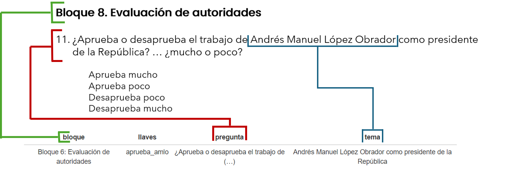
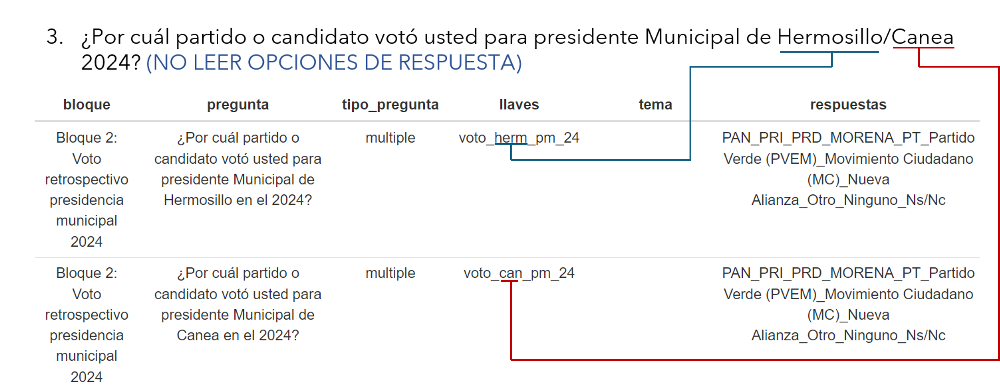

```{r setup, include=FALSE}
knitr::opts_chunk$set(echo = TRUE)
library(tidyverse)
library(knitr)
library(readxl)
library(DT)
```

## Introducción

<div class="watermark">

</div>

<div align="justify"> 

El diccionario es uno de los insumos básicos para el uso de la clase “Encuesta” perteneciente a la paquetería “encuestar”. Su función básica consiste en ser un diccionario de datos particular que describe el contenido de cada una de las variables que componen la base de datos principal para el análisis de las encuestas realizadas. 

Así mismo el diccionario es el nexo y el insumo que se necesita, para que el proveedor a cargo de configurar los datos en SurveyToGo pueda darle la estructura correspondiente a la base de datos que será exportada de la plataforma. 

El diccionario es esencial para que la estructura de base de datos de las encuestas recabadas pueda ser leída y procesada correctamente, así como ser una herramienta sencilla para describir de manera ágil las variables que componen a la base de datos y su relación con el cuestionario de la encuesta en cuestión. Por lo general consta de un archivo generado en Excel, pero se puede cualquier formato que permita manejar una hoja de datos, y que pueda ser leída e interpretada por alguna librería de R. 

\pagebreak

## Estructura

El diccionario se compone de una serie de variables/columnas básicas, algunas de ellas son esenciales y tienen una estructura determinada, otras son variables de apoyo que mejoran la compresión y descripción de las variables en la base de datos.

```{r dicc_ejemp_1,echo=FALSE}
ejemp_dic <- read_excel('./insumos/diccionario_ejemp_gen.xlsx')|>
  mutate(respuestas = ifelse(is.na(respuestas),'',respuestas),
         tema = ifelse(is.na(tema),'',tema))


ejemp_dic_1<- ejemp_dic|>
 # select(tipo_pregunta,llaves,respuestas)|>
  filter(llaves %in% c('edad','sexo','colonia_bien','colonia_mal','voto_pr_24','afirmacion_seguridad'))

kable(ejemp_dic_1,caption = 'Tabla 1. Ejemplo de un diccionario',align = 'c')

```

\pagebreak

### Estructura básica

El diccionario requiere de 3 variables/columnas básicas para permitir que la clase “Encuesta” pueda ser ejecutada correctamente, así mismo, es la información más básica que puede describir las variables que conforman la base de datos. 

```{r dicc_ejemp_2,echo=FALSE}

ejemp_dic_2<- ejemp_dic|>
  select(tipo_pregunta,llaves,respuestas)|>
  filter(llaves %in% c('edad','sexo','colonia_bien','voto_pr_24','afirmacion_seguridad'))

kable(ejemp_dic_2,caption = 'Tabla 2. Estructura básica del diccionario de datos',align = 'c')

```

Estas 3 columnas *tipo_pregunta, llaves* y *respuestas*, al ser las variables básicas, **siempre deben de estar presentes en el diccionario, y escritas estrictamente como se muestra**, sin ningún cambio. El orden de las variables es indiferente, ya que la clase “Encuestar” buscará las variables por sus nombres, y no por posición, por eso es necesario que estas variables conserven el mismo nombre. A continuación, se describirá cada una:

- **tipo_pregunta**: Como su nombre lo indica, esta columna describe de qué manera fue respondida la pregunta hecha en la encuesta, y que tipo de resultado se espera recibir en la variable. Esta columna consta de 3 categorías: 
  * Abierta: Cuando la pregunta no tiene ningún tipo de respuesta esperable, y el contenido de la misma es libre de tener la estructura que sea.
  * multiple: Cuando la pregunta tiene una serie de repuestas específicas, también entiéndase como respuestas categóricas, por lo que cualquier otro resultado fuera de las respuestas esperadas puede generar conflicto con la paquetería.
  * numéricas: Como su nombre lo dice, las respuestas pueden ser de tipo numérico, ya sean números enteros, o decimales.
  \n
  
- **llaves**: Las llaves corresponden a los nombres de las variables/columnas que se encuentran en la base de datos, por lo que esta variable del diccionario es vital, ya que es la que le da sentido a la lectura de la información en la base de datos, y es la que da un punto de referencia importante al proveedor que realiza la configuración de base de datos en SurveyToGo. Posee una estructura y lógica particular en la asignación de datos, por favor revise ese apartado más adelante.

- **respuestas**: Describe las posibles respuestas que aceptan las variables que corresponden a las variables múltiples/categóricas, y a veces también al tipo numéricas. Las posibles respuestas deben de estar separadas por un guion bajo (_), para que la clase “Encuesta” pueda procesarse correctamente. En caso de que la variable que se describe sea una pregunta de tipo abierta, el dato puede estar vacío. 

\pagebreak

### Variables de apoyo

Estas variables corresponden a los apartados que no son estrictamente requeridas para el procesamiento de la clase “Encuesta”, por lo que su estructura es más libre, y se pueden agregar los apartados que se crean necesarias para la mejor comprensión de las variables/columnas contenidas en la base de datos de la encuesta. Se anexa un ejemplo de las variables/columnas de apoyo, junto con la columna *llaves* de la estructura básica del diccionario.

```{r dicc_ejemp_3,echo=FALSE}
ejemp_dic_3<- ejemp_dic|>
  select(bloque,llaves,pregunta,tema)|>
  filter(llaves %in% c('edad','sexo','colonia_bien','voto_pr_24','afirmacion_seguridad'))

kable(ejemp_dic_3,caption = 'Tabla 3. Estructura de las variables/columnas de apoyo en el diccionario',align = 'c')
```

En la actualidad las variables de apoyo *bloque, pregunta* y *tema* son las que se utilizan para darle más contexto a las variables de la base de datos, descritas en la columna *llaves*. Estas variables de apoyo permiten comprender de mejor manera a que se refiere cada variable de la base de datos y están estrechamente relacionadas al contenido del cuestionario que se utiliza para el levantamiento de las encuestas. 

Si bien como se mencionó previamente, aunque la estructura de estas variables es libre, se recomienda que el nombre de las columnas/variables se mantenga consistente a lo largo de la realización de diccionarios subsecuentes, ya que estas variables también son de apoyo para procesamiento de datos, generación de gráficas y análisis general de la encuesta. Se describen las columnas de apoyo que actualmente se utilizan:



- **bloque**: Para facilitar la lectura del cuestionario, así como para dar orden y estructura al mismo, se suelen crear bloques de preguntas que comparten una temática particular, de manera que esta columna en el diccionario corresponde al bloque o temática de cada pregunta a la que se hace referencia en la base de datos. Por lo general suele haber un desfase en la numeración de los bloques que aparecen en el cuestionario y la numeración descrita en el diccionario, esto debido a que el cuestionario incluye preguntas de control y filtro que no son procesadas para la generación de información y es conocida como “Bloque 0” para el diccionario.

- **pregunta**: Corresponde a la transcripción textual o parcial de la pregunta realizada en el cuestionario de la encuesta. Ayuda a dar sentido al nombre asignado a las variables de la base de datos de la encuesta. *Las instrucciones que están entre paréntesis y en mayúsculas no deben ser incluidas y capturadas.*

- **tema**: Hace referencia a la temática o personaje a la que se hace referencia en la pregunta. Esta variable ayuda a poder identificar de manera directa sobre que se está hablando, y permite referenciar al sujeto de la pregunta si es necesario mencionarlo en algún procesamiento o gráfico.
Se puede observar que estas variables permiten dotar de información que por si mismo los nombres contenidos en la columna *llaves* no pueden proporcionar, y es una manera de transportar el contenido del cuestionario de la encuesta a una estructura de base de datos. 

Se puede observar que estas variables permiten dotar de información que por si mismo los nombres contenidos en la columna *llaves* no pueden proporcionar, y es una manera de transportar el contenido del cuestionario de la encuesta a una estructura de base de datos. 

\pagebreak

## Llaves

Las llaves son de vital importancia para poder dar sentido a la base de datos, ya que permiten organizar, acceder y procesar eficientemente los datos almacenados. Estas llaves, facilitan la referencia precisa a las variables contenidas en la base de datos durante el procesamiento de la información.
El proceso de nombramiento de estas llaves es fundamental y sigue una estructura específica por varios motivos:

1.	**Claridad de Referencia**: Es vital diferenciar claramente a qué o a quién se refiere cada llave, especialmente en situaciones donde preguntas similares en una encuesta pueden dirigirse a diferentes sujetos o lugares. Esto evita confusiones y asegura que cada dato se asocie correctamente.

2.	**Eficiencia en el Procesamiento**: Una nomenclatura coherente y sistemática permite optimizar el procesamiento de datos. Al seguir patrones establecidos en la codificación, se pueden reutilizar algoritmos existentes, lo cual reduce el tiempo de procesamiento y permite enfocarse en los aspectos más específicos y detallados de cada conjunto de datos, potenciando la eficiencia y precisión en el manejo de la información.

\pagebreak

### Nombramiento de las llaves

El primer paso para comenzar el nombramiento de las llaves es la lectura del cuestionario. Se recomienda que al nombrar las llaves, esta acción se vaya realizando junto a la lectura del propio cuestionario, para que se tenga acceso al mayor contexto posible y poder dotar de un nombre que facilite la interpretación de a que variable/pregunta se hace referencia mediante el nombre de la llave. 

Por lo general cada pregunta del cuestionario corresponde a una variable en la base de datos, y por lo tanto a una llave, aunque hay preguntas que constan de la obtención de más de una repuesta, y por lo tanto requiere una llave particular a pesar de estar contenida en la misma pregunta, esta clase de contexto lo otorga el cuestionario de la encuesta, por lo que se reitera realizar el nombramiento de las llaves acompañado del cuestionario.

En la tabla 1 y 3 se observa un ejemplo de cómo se relaciona el nombre de la llave, con la pregunta correspondiente, utilizando palabras clave que permitan referenciar la pregunta, el tipo de respuesta esperada y/o sobre quién o que se está hablando. 


</div>

Tomando como ejemplo la tabla 1, se puede observar cómo se toman las palabras clave para nombrar las llaves. Obsérvese como en el caso de las preguntas del Bloque 1, éstas son casi idénticas, solo diferenciadas por el tipo de percepción que se quiere destacar, la primera con un enfoque positivo y la segunda con un enfoque negativo. Son las palabras “bien” y “mal” las que permiten diferenciar las llaves, y por ende las variables en la base de datos. Es importante tomar lo anterior en cuenta, para definir de manera óptima las variables que formarán parte de la base de datos. Por último, **se pide que ninguna palabra clave coincida con algún prefijo de nivel de gobierno o de lugar**, estos dos casos particulares son explicados a continuación. 

\pagebreak

### Niveles de gobierno

En las encuestas es común que se realicen preguntas de conocimiento y opinión sobre gobernantes o candidatos a algún cargo de elección popular, por lo que es normal que se realice la misma pregunta aplicada a varios personajes con diferentes niveles de gobierno. Por lo que se ha propuesto el uso de sufijos para poder separar las preguntas. 

Para este caso se muestra una tabla con el mismo tipo de pregunta pero para los diferentes niveles de gobierno.

```{r dicc_ejemp_4,echo=FALSE}
ejemp_dic_4<- ejemp_dic[c(5:13),]

kable(ejemp_dic_4,caption = 'Tabla 4. Llaves con diferentes niveles de gobierno',align = 'c')
```

Como muestra la columna *pregunta* de la tabla 4, se realizan dos preguntas, la primera siendo*” ¿Por cuál partido o candidato votó usted para (…) en el 2024?”*, aunque con algunas variaciones; y la segunda siendo *”¿Cuál fue la razón principal por la que votó por (…)? Me podría detallar los motivos de su preferencia”*, siendo prácticamente la misma pregunta. Lo que diferencia los valores en la columna *llaves* son los sufijos “pm”, “sen”, “gb” y “pm” separados por guion bajo (_) del resto del elemento de la llave. Estos sufijos permiten identificar a que nivel se hace referencia, aunque se esté realizando la misma pregunta. 

A continuación, se muestra una tabla con los sufijos utilizados para los diferentes niveles de gobierno:

```{r sufi_gob,echo=FALSE}
sufij_gob<- read_excel('./insumos/niveles_gob.xlsx')

kable(sufij_gob,caption = 'Tabla 5. Sufijos para los diferentes niveles de gobierno',align = 'c')
```

Como se observó en el esquema de la tabla 1, en la llave *“voto_pr_2024”*, se recomienda que para la estructura de la llave, primero se defina la palabra clave que representa a que tipo de pregunta se refiere, y después sea seguido del sufijo correspondiente al nivel de gobierno. También es necesario que se encuentre separado por guion bajo (_), permitiendo separar los sufijos de los demás elementos de la llave. 

Para los elementos encerrados entre los cuadros [lugar] y [secretaria], se recomienda hacer uso de abreviaciones. En este caso, si se refiriera a la “Secretaria de Economía”, la llave correspondiente podría ser *“clave_sec_eco”*. Para el tratamiento de lugares se pide visitar el siguiente apartado.

\pagebreak

### Lugares

Por lo general se utilizan los sufijos o abreviaciones de lugares cuando en una misma encuesta se hace referencia a varios lugares, o a varios niveles regionales; ya sea que, por ejemplo, se hable de dos municipios en la misma encuesta, o se haga una referencia a nivel municipal y después a nivel estatal. En caso de que siempre se esté haciendo referencia al mismo lugar, no es necesario el uso de este tipo de sufijos.

A diferencia del caso de los niveles de gobierno, para el nombramiento de lugares no existen abreviaciones estándar, de manera que se deja a consideración la forma en la que se realicen las abreviaciones. Aun así, hay una serie de consideraciones que hay que tomar en cuenta para la asignación de los sufijos:

1.	**Que ninguno de los sufijos de los lugares coincida con alguno de los sufijos asignados para los niveles de gobierno.**
2.	Que los sufijos estén compuestos entre 2 a 4 letras. 
3.	Que **no coincidan los sufijos con alguna palabra clave de pregunta.**
4.	Que **dos o más lugares diferentes no compartan el mismo sufijo.**
5.	Que el sufijo de lugar sea precedido de la palabra clave que referencia a la pregunta.


```{r dicc_ejemp_5,echo=FALSE}
ejemp_dic_5 <-  ejemp_dic|>
  filter(llaves %in% c('voto_herm_pm_24','voto_can_pm_24','afirmacion_mex',
                       'afirmacion_son','accion_principal_son','accion_principal_mex'))

kable(ejemp_dic_5,caption = 'Tabla 6. Ejemplo de uso de lugares para nombramiento de las llaves',align = 'c')
```

En la tabla 6 se observan varios ejemplos, de cómo se utilizan lo sufijos “herm”, “can” para referenciar municipios, “son” para referenciar al Estado de Sonora y “mex” para referenciar a México como país, y cada llave comenzando con las palabras clave de la pregunta.

Es común encontrar situaciones donde exista la posibilidad de que haya lugares que compartan raíces o elementos en su escritura, y que se quiera aplicar alguna de ellas para asignar algún sufijo. Se recomienda para el caso anterior evitar ambigüedades, y que las llaves se puedan distinguir de alguna manera, aquí se plantean algunos ejemplos de cómo lidiar con este tipo de situaciones:

```{r ejemp_lug,echo=FALSE}
ejemp_lug <- read_excel('./insumos/ejem_lugs.xlsx')

kable(ejemp_lug,caption = 'Tabla 7. Casos en controversia en la asignación de sufijos para lugares',align = 'c')
```

Como se puede observar la intención de este tipo de sufijos busca precisar a que lugar o región se está haciendo referencia, y evitar confusiones en caso de que la encuesta se lleve a diferentes lugares, o niveles territoriales. 

```{r dicc_ejemp_5_1,echo=FALSE}
ejemp_dic_5_1 <-  ejemp_dic|>
  filter(llaves %in% c('voto_herm_pm_24','voto_can_pm_24','accion_principal_son','accion_principal_mex'))

kable(ejemp_dic_5_1,align = 'c')
```

Regresando al ejemplo de la tabla 6, las preguntas *”¿Por cuál partido o candidato votó usted para presidente Municipal de (…) en el 2024?”* y *“¿Cuál considera que es la principal acción positiva del (…)?”* son la misma pregunta, pero hacen referencia a diferentes lugares, por lo que se utilizan los sufijos para diferenciarlos.

En el contexto de los ejemplos anteriores, para separar la región país y la región estado, se pueden utilizar también los sufijos “pais” y “edo”; pero no así el sufijo “mun” ya que mientras se esta hablando de **un solo país** y **un solo estado**, no es el caso a nivel municipal puesto que se está preguntando sobre dos municipios (Hermosillo y Canea). Estos detalles finos se deben de considerar al momento de asignar sufijos.

\pagebreak

### Personajes y figuras

En las encuestas suele ser común referenciar directamente a personajes de la vida pública, candidatos a puestos de elección, etc. E igual que en los casos anteriores, se puede hacer la misma pregunta a diferentes figuras, por lo que se utilizan sus nombres de manera directa para diferenciarlos.

```{r dicc_ejemp_6,echo=FALSE}
ejemp_dic_6 <-  ejemp_dic|>
  filter(llaves %in% c('aprueba_amlo'))

kable(ejemp_dic_6,caption = 'Tabla 8. Uso de nombres/apodos para referenciar personajes',align = 'c')
```

Como se observa en la tabla anterior y en la 2da figura, en la pregunta se menciona a Andres Manuel López Obredor, por lo que se utiliza “amlo” en la llave “aprueba_amlo”, ya que la pregunta hace alusión directa a él.

¿Cuándo utilizar un sufijo de nivel de gobierno y cuando utilizar el nombre? Se recomienda utilizar el nombre del personaje cuando la pregunta hace alusión directa al personaje, o cuando varios personajes se encuentran en la misma posición, ya sea aspirando al mismo cargo, se encuentran en el mismo nivel, o carecen de algún título/posición que pueda utilizarse para referenciarlos. Por lo general preguntas referidas al conocimiento y/ú opinión de algún personaje son las que necesitan este tipo de asignación.

Al asignar nombres a las llaves que refieren a personajes, se tiene la libertad de elegir cualquier denominación adecuada. Sin embargo, es esencial que estos nombres correspondan claramente al personaje aludido, eviten duplicidades con otros mencionados en la encuesta y no sean excesivamente largos. Es posible utilizar el nombre, apellidos, y apodos del personaje en cuestión.

\pagebreak

### Estructuras generales y compuestas

Tras explicarse los casos y uso de sufijos para niveles de gobierno, lugares y personajes, así como la asignación de palabras clave y tras observar los ejemplos previos, se tiene fundamentos de en cuales casos se deban utilizar varios tipos de sufijos, estos llevan una estructura particular. La cual consiste en la siguiente forma:


Siendo este el orden recomendado para la asignación se sufijos en las llaves. Si alguno de los elementos mostrados no forma parte, o no es necesario su uso, no altera el resto del orden del resto de elementos de la llave. 

El elemento [complemento opcional] es un complemento que como se menciona de forma implícita, es opcional, y sirve para dar más precisión del tema del que se está hablando. Para los ejemplos de las tablas 4 y 6 en el Bloque 2, se pueden observar que las llaves tienen la estructura mencionada, siendo “_24” el complemento opcional que da contexto de que las votaciones a las que se hace referencia corresponden a las del 2024.



Si observamos la pregunta mostrada en el esquema anterior, es la misa para el mismo nivel de gobierno y en la misma elección, en este caso lo que diferencia es el lugar al que se hace referencia, permitiendo hacer una distinción en la base de datos de a qué candidato se refiere.

En casos muy raros es necesario incluir el nombre de algún personaje incluyendo los sufijos antes mencionados, en ese caso se recomienda la siguiente estructura. Alterando poco el orden planteado en la estructura anterior. 


\pagebreak

## Respuestas

La columna *respuestas* solo tiene información cuando la pregunta es del tipo múltiple, o numérica en caso de esperase números enteros. Los posibles resultados deben ser separados por guion bajo (_) ya que de esta manera la clase “Encuestar” puede separar las respuestas, aunque éstas tengan espacios.


El esquema anterior muestra como se almacenan los resultados de variables categóricas y numéricas. Obsérvese como la pregunta *”¿Aprueba o desaprueba el trabajo de Andrés Manuel López Obrador…?”* tiene respuestas compuestas con más de una palabra, por lo que el guion bajo ayuda a poder separar cada respuesta de manera óptima.  

Se debe destacar que el elemento *(NO LEER)* es retirado de la captura de las respuestas, esto debido a que esa es una instrucción para el encuestador, por lo que no es necesario que sea agregado. **Este tipo de instrucciones que están entre paréntesis y en mayúsculas no deben ser incluidas y capturadas. **

Es crucial **transcribir de manera explícita y textual las respuestas del cuestionario**, dado que el diccionario no solo sirve como referencia interna, sino que también es utilizado por el proveedor de la plataforma de encuestas. **Errores en la captura de las columnas *respuestas* pueden resultar en datos incorrectos en la base de datos**, lo que podría provocar desde retrasos en el procesamiento de la información hasta volver una variable completamente inservible.

\pagebreak

## Conclusiones

El diccionario es un elemento fundamental para poder crear, no solo una referencia directa al cuestionario, sino también un medio que permite el correcto manejo de la base de datos. Esta guía busca poder ayudar a dar una mejor estructura a la construcción de los diccionarios, además de poder dar sentido a “él porque” da cada uno de los elementos que conforman el diccionario.

Si bien, puede haber varios casos que no se contemplen al 100% en esta guía, se confía en el criterio del usuario, y que esta guía sea de apoyo para cualquier controversia. 

Así mismo, se pide que la construcción del diccionario sea los mas estructurado posible, puesto que el diccionario puede ser una fuente de apoyo muy valioso para el procesamiento de datos, pero también la construcción de un mal diccionario puede generar problemas graves para el tratamiento de la información.


</div>


