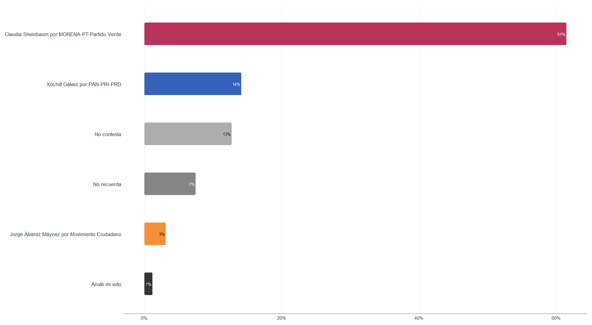

<!-- README.md is generated from README.Rmd. Please edit that file -->

```{r, include = FALSE}
knitr::opts_chunk$set(
  collapse = TRUE,
  comment = "#>",
  fig.path = "man/figures/README-",
  out.width = "100%"
)
```

# encuestar

<!-- badges: start -->
<!-- badges: end -->

El ojetivo de la paquetería encuestar es producir los resultados de las estimaciones asociadas al diseño muestral generado por la paquetería muestrear. También contiene contiene la aplicación de seguimiento de levantamiento de la encuesta.

## Instalación

Sírvase de instalar la versión de producción desde [GitHub](https://github.com/) con:

``` r
devtools::install_github(repo = "https://github.com/morant-consultores/encuestar.git", ref = "master")
```

## Ejemplo

Estimación de intención de voto hacia candidatos


