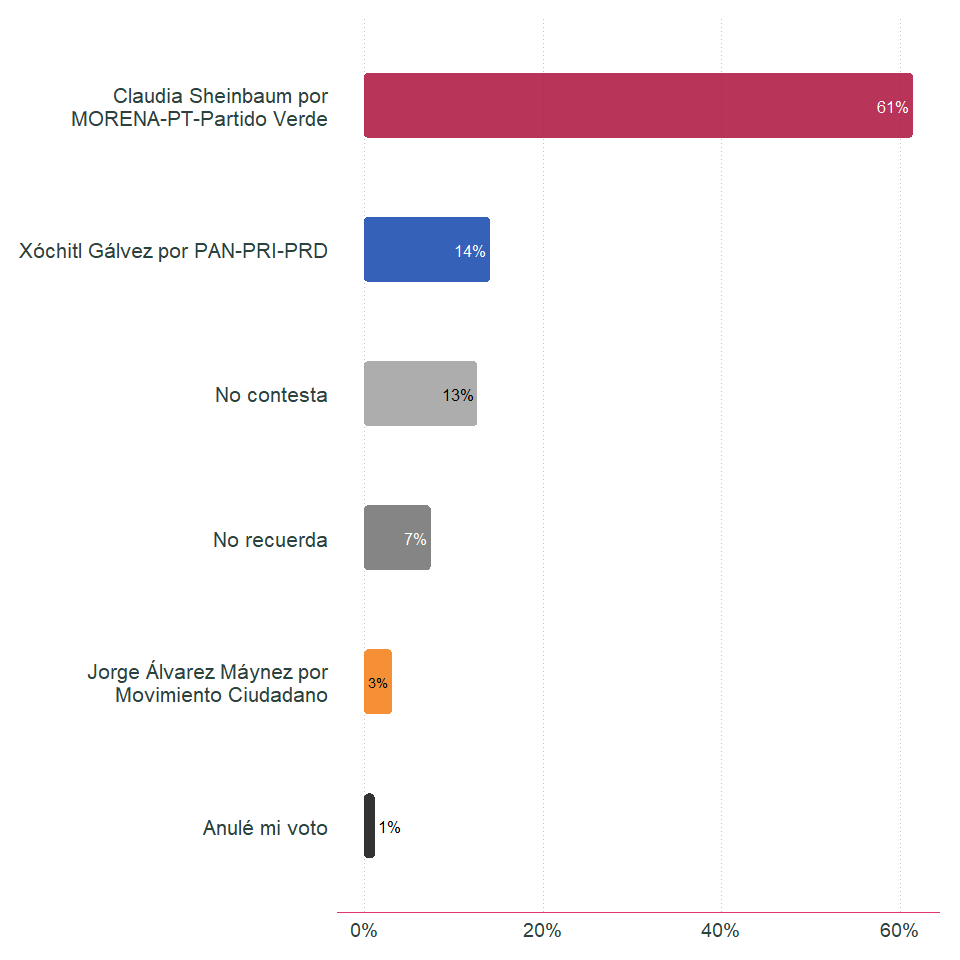

<!-- README.md is generated from README.Rmd. Please edit that file -->

# encuestar

<!-- badges: start -->
<!-- badges: end -->

El ojetivo de la paquetería es producir los resultados de las
estimaciones asociadas al diseño muestral generado por la paquetería
muestrear. También contiene contiene la aplicación de seguimiento de
levantamiento de la encuesta.

## Instalación

Sírvase de instalar la versión de producción desde
[GitHub](https://github.com/) con:

``` r
devtools::install_github(repo = "https://github.com/morant-consultores/encuestar.git", ref = "master", build_vignettes =  TRUE)
```

## Ejemplo

Estimación de intención de voto hacia candidatos

``` r
library(encuestar)

encuesta_demo$Resultados$Descriptiva$barras_categorica(codigo = 'voto_pr_24',
                                                       salto = 30) +
  ggplot2::scale_fill_manual(values = c("Claudia Sheinbaum por MORENA-PT-Partido Verde" = "#A6032F",
                                        "Xóchitl Gálvez por PAN-PRI-PRD" = "#0339a6",
                                        "No recuerda" = "gray40",
                                        "No contesta" = "gray60",
                                        "Jorge Álvarez Máynez por Movimiento Ciudadano" = "#F27405",
                                        "Anulé mi voto" = "black"))
```


